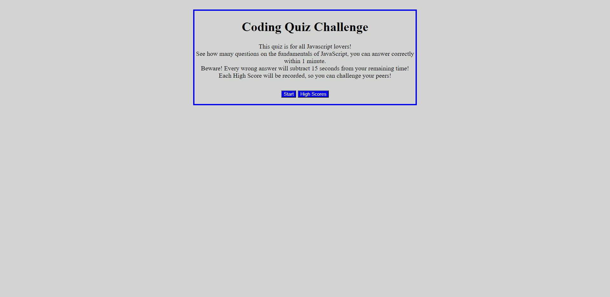

# Code-Quiz# 

## Description
Used HTML, CSS, and Javascript to create a interactive question game about Javascript.
HTML
• created two HTML files to make code better to read and understand. The first, index.html holds the the introduction and questions. The second html file contains the High Score form. 
CSS
• Used to make all buttons the same and to border the quiz itself.
Javascript
• Created an interactive quiz game that not only times the player but also keeps their high scores.
• Made the code easier to read by using some shorthand syntax.
• Labeled each question as correct or incorrect once the answer is pressed. If the answer is incorrect the timer will subtract 15 seconds. Game ends once all questions are completed or the timer runs out. 

## Production Website
[Code Quiz Link](https://jenmlucas.github.io/Code-Quiz/ "Code Quiz")

## Usage
This is how the website will look on your device. 

  
## Credits

[University of Arizona Bootcamp](https://courses.bootcampspot.com "UofA")

[Stack Overflow](https://stackoverflow.com/questions/7549561/section-vs-article-html5/ "StackOverflow")

[MDN Web DOCs](https://developer.mozilla.org/en-US/docs/Web/HTML/Element/aside "MDN")

[w3schools](https://www.w3schools.com/ "w3schools")

## Badges

